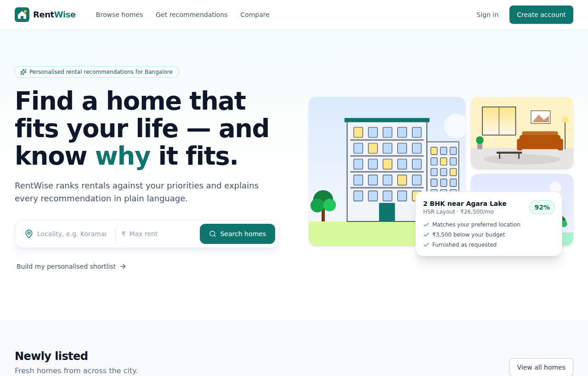
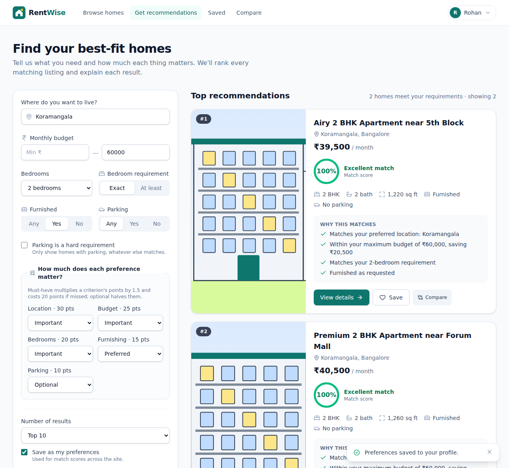
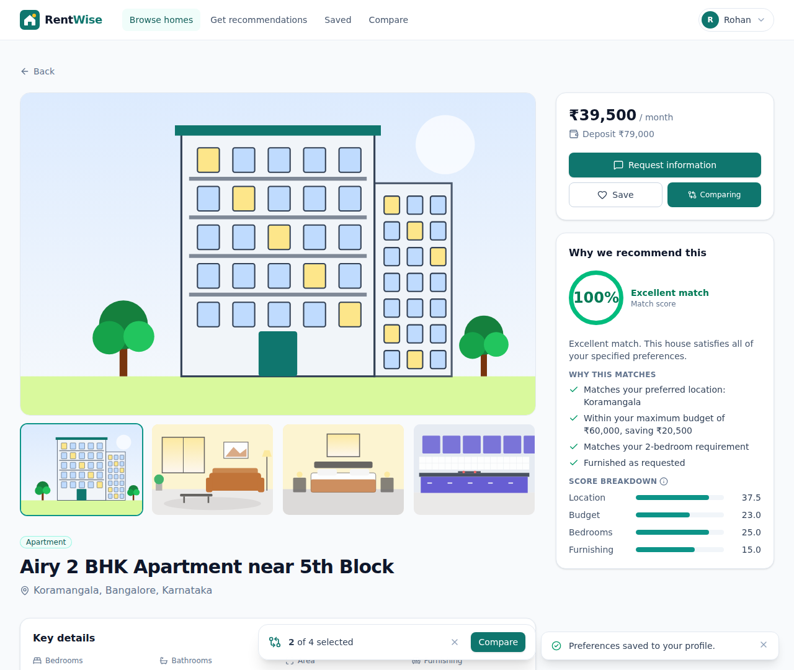
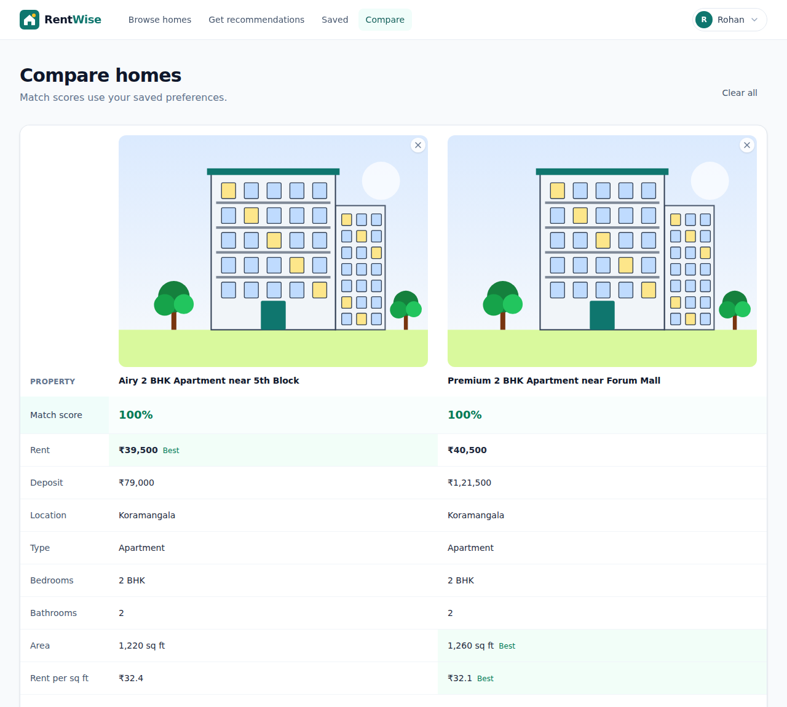
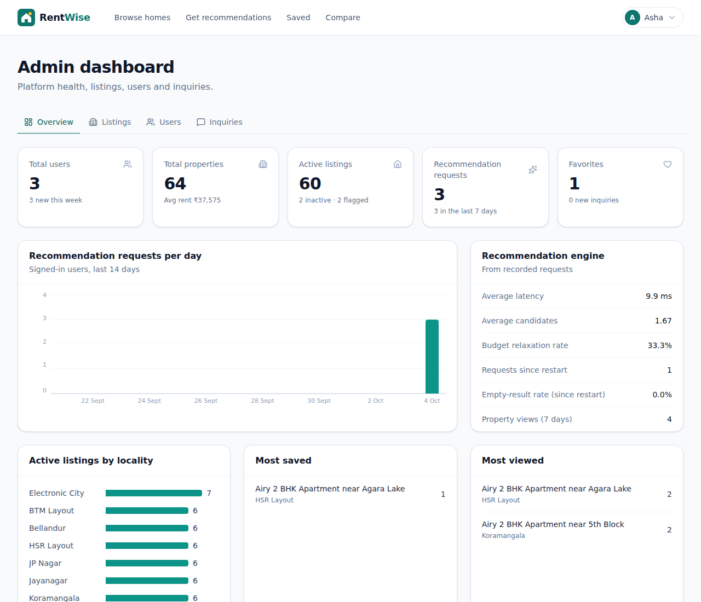
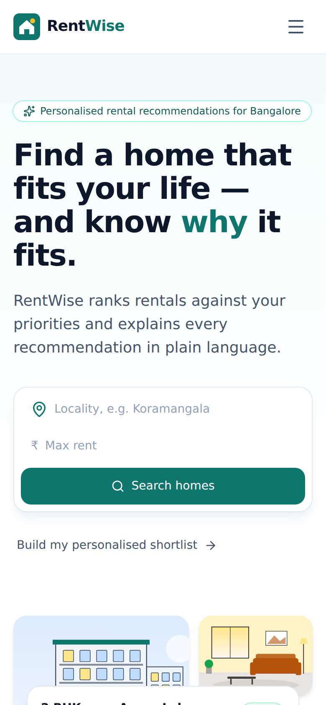

# RentWise: Explainable Rental Recommendations

**A full-stack rental marketplace that ranks homes against each user's priorities and explains every recommendation in plain language.**

**Live demo:** https://rentwise-9twy.onrender.com
(Free hosting: the first visit after a quiet period can take up to about a minute while the server wakes up.)



| | |
|---|---|
| **Stack** | React 19 + TypeScript · Django 5 + Django REST Framework · PostgreSQL 16 · Docker |
| **Hosting** | Render (website + API), Neon (database) |
| **Tests** | 233 automated backend tests (engine, API, security, performance); CI on every push |
| **Highlights** | Transparent 100-point scoring · per-user priorities · budget relaxation · JWT auth · admin analytics |

---

## Contents

1. [The problem](#1-the-problem)
2. [What it does](#2-what-it-does)
3. [Screenshots](#3-screenshots)
4. [How the recommendation engine works](#4-how-the-recommendation-engine-works)
5. [Architecture](#5-architecture)
6. [Key engineering decisions](#6-key-engineering-decisions)
7. [Security](#7-security)
8. [Data model](#8-data-model)
9. [API overview](#9-api-overview)
10. [Testing and quality](#10-testing-and-quality)
11. [Performance](#11-performance)
12. [Deployment](#12-deployment)
13. [Run it locally](#13-run-it-locally)
14. [Project structure](#14-project-structure)
15. [Challenges and how I solved them](#15-challenges-and-how-i-solved-them)
16. [Limitations and future work](#16-limitations-and-future-work)

---

## 1. The problem

Rental sites show long lists sorted by price or date. A renter has to work out for themselves which homes fit their mix of needs, such as *"must be in HSR Layout, ideally under ₹25,000, two bedrooms, furnished would be nice, parking doesn't matter much"*, and the site never says **why** a listing is shown.

RentWise solves this in two ways:

1. **Personal ranking:** each user says what matters and how much (must have, important, preferred or optional), and every matching home gets a score out of 100.
2. **Explanations:** every result lists what it gets right and where it falls short, using the home's actual data.

The recommender is deliberately **rule-based**, not machine learning: every score can be traced back to a published rule, which is what users and reviewers can trust. Section 16 covers how ML could be added on top later.

---

## 2. What it does

**For renters**
- Sign up and log in securely
- Browse and search listings by location, budget, bedrooms, bathrooms, furnishing, parking and property type, with sorting and pagination
- Get **personalised recommendations** with a match score, a per-criterion breakdown, strengths and weaknesses
- Save favourites, **compare up to 4 homes** side by side, and review past searches
- Save preferences once and see a personal match score on every property page
- Send an inquiry about a listing

**For administrators**
- A dashboard of platform statistics: users, listings, recommendation usage, engine latency and a daily usage chart
- Create, edit, deactivate, flag (for suspicious listings) or delete listings
- Manage users (promote to admin, deactivate) and triage inquiries

**Polish:** responsive down to phone width, loading skeletons, empty, error and offline states, and accessible forms and dialogs.

---

## 3. Screenshots

**Recommendations, each with a score and explanation**


**Property details with a personal match breakdown**


**Side-by-side comparison**


**Admin dashboard**


<details>
<summary><b>Mobile view</b></summary>


</details>

---

## 4. How the recommendation engine works

The engine is a pipeline. Each stage has one job:

```
User preferences
   │
   ▼
1. Validate input              reject negative budgets, bad enums, top_n > 100…
   │
   ▼
2. Hard filters (in SQL)       active listings only · budget range · bedrooms ·
   │                           location · required parking
   │      └─ nothing found? ─► raise the budget by 10% → 20% → 30% and retry
   ▼
3. Score every candidate       weighted points per criterion
   │
   ▼
4. Apply priorities            ×1.5 must-have · ×1.25 important · ×1.0 preferred · ×0.5 optional
   │                           −20 for each must-have that isn't met · clamp to 0–100
   ▼
5. Rank deterministically      score ↓, then rent ↑, then area ↓, then id ↑
   │
   ▼
6. Keep the Top-N              only these are serialised and explained
   │
   ▼
7. Explain                     "Within your budget, saving ₹2,000", "Parking is unavailable"…
```

### The scoring model (100 points)

| Criterion | Points | How they're earned |
|---|---:|---|
| Location | 30 | The locality matches the requested area |
| Budget | 25 | Within budget: 15 points, plus up to 10 more the further below budget it is |
| Bedrooms | 20 | Exact match. In "at least" mode, −5 per extra bedroom (minimum 10) |
| Furnished | 15 | Matches the furnishing preference |
| Parking | 10 | Matches the parking preference |

### Worked example (checked by an automated test)

**Home:** HSR Layout, ₹23,000 per month, 2 bedrooms, furnished, no parking
**Preferences:** HSR, budget ₹20,000–25,000, exactly 2 bedrooms, furnished, no parking, all priorities "preferred"

| Criterion | Calculation | Points |
|---|---|---:|
| Location | "HSR" matches "HSR Layout" | 30.0 |
| Budget | 15 + 10 × (₹2,000 saved ÷ ₹25,000) | 15.8 |
| Bedrooms | 2 = 2 | 20.0 |
| Furnished | yes = yes | 15.0 |
| Parking | no = no | 10.0 |
| **Score** | | **90.8 / 100** |

If the user had marked parking as a **must have** and the home had none, the parking points would be 0 and a 20-point penalty would apply.

### Budget relaxation, done honestly

If nothing fits the budget, the engine retries at +10%, +20% and +30%, keeping **every other** requirement. The response says plainly that it did this, for example *"We increased your budget by 20%, from ₹26,000 to ₹31,200"*, and each explanation notes when a home is over the original budget. It **never** relaxes a budget the user marked as must-have.

---

## 5. Architecture

```
          Browser (React SPA)
                │  HTTPS, same origin
                ▼
   ┌──────────────────────────────┐
   │ Static site / nginx          │  serves the React build
   │ /api/* is proxied            │  and adds security headers (CSP)
   └──────────────┬───────────────┘
                  ▼
   ┌──────────────────────────────┐
   │ Django REST API (Gunicorn)   │
   │  core/      errors, logging, │
   │             request IDs,     │
   │             permissions      │
   │  accounts/  users, JWT auth  │
   │  rentals/   properties,      │
   │   favorites, preferences,    │
   │   history, admin             │
   │   services/                  │
   │    RecommendationService     │
   │    analytics                 │
   └──────────────┬───────────────┘
                  ▼
          PostgreSQL (Neon)
```

- **Views are thin.** They validate input and call services, and the business logic lives in `services/`.
- **Scoring is a pure function** with no database access, so it's fast and easy to unit-test.
- **One origin:** the browser only talks to the website, which forwards `/api` calls. That keeps login cookies simple and secure, with no cross-site cookies.

---

## 6. Key engineering decisions

| Decision | Why |
|---|---|
| **Rule-based, explainable scoring** instead of ML | Every result can be justified to the user. ML needs interaction data the app is only now collecting. |
| **Filter in SQL, score in Python, explain only the Top-N** | The database narrows thousands of rows cheaply, and explanation work never depends on how many homes matched. |
| **Load only the 7 columns scoring needs** | Profiling showed that building full rows was the main cost. Loading 25,000 rows took about 0.50 s with all columns and about 0.30 s with only the scoring columns. |
| **Deterministic tie-breaking** | Identical input always gives the same order, which makes results stable and testable. |
| **Access token in memory, refresh token in an HttpOnly cookie** | Script injected into the page can't read the refresh token, and the page survives a reload without storing tokens in `localStorage`. |
| **A modular monolith, not microservices** | One deployable unit is simpler to run and reason about at this scale, with clear module boundaries inside. |
| **Config in one file** (`recommendation_config.py`) | Weights, multipliers and penalties are tunable without hunting through code. |
| **Docker plus a Render blueprint** | The same image runs on a laptop and in production; infrastructure is code. |

---

## 7. Security

- **Passwords** are hashed (never stored in plain text) and checked for strength.
- **JWT authentication:** short-lived access tokens (15 minutes) and rotating refresh tokens that are blacklisted on use, on logout and on password change.
- **Role-based access:** `USER` and `ADMIN`. Admin endpoints are enforced on the server, never only by hiding buttons.
- **User isolation:** favourites, history and preferences are always filtered to the signed-in user, and tests prove one user can't see another's data.
- **Input validation:** budgets, room counts, enums, coordinates, page sizes and image URLs are validated server-side. `javascript:` URLs are blocked, for example.
- **Rate limiting** on login, registration, recommendations and inquiries.
- **Production hardening:** HTTPS redirect, HSTS, secure cookies, a strict Content-Security-Policy, explicit CORS, and secrets only from environment variables.
- **Safe errors:** one consistent JSON error format. Stack traces and internals never reach the client.

---

## 8. Data model

| Table | Purpose |
|---|---|
| **User** | Email login, name, phone, role (`USER` / `ADMIN`) |
| **House** (property) | Title, location, rent, deposit, bedrooms, bathrooms, area, furnished, parking, type, floor, availability, amenities, status (active / inactive / flagged) |
| **PropertyImage** | Several images per property, one primary |
| **Favorite** | User ↔ property, unique per pair |
| **UserPreference** | A user's saved search preferences and priorities |
| **RecommendationHistory** | Each search: preferences, result IDs, top score, latency |
| **PropertyInteraction** | Views, saves and contacts: the data a future ML ranker would learn from |
| **Inquiry** | Messages from users about listings |

Indexes are chosen for real query patterns: for example `(bedrooms, rent)` for the recommendation filter, `(status, rent)` for browsing, and `(user, created_at)` for history. Database check constraints stop negative rent or impossible room counts.

---

## 9. API overview

Interactive docs (Swagger): `/api/docs/` on the API host.

| Area | Endpoints |
|---|---|
| Auth | `POST /api/auth/register/`, `login/`, `refresh/`, `logout/` |
| Profile | `GET/PATCH /api/users/me/`, `POST /api/users/me/password/` |
| Properties | `GET /api/properties/` (search, filters, sort, pages), `GET /api/properties/{id}/`, `GET /api/properties/compare/?ids=1,2,3`; admins can also create, update and delete |
| Recommendations | `POST /api/recommendations/`, `GET/DELETE /api/recommendations/history/` |
| Favourites | `GET /api/favorites/`, `POST/DELETE /api/favorites/{id}/` |
| Preferences | `GET/PUT/PATCH /api/preferences/` |
| Admin | `/api/admin/analytics/`, `/api/admin/users/`, `/api/admin/properties/`, `/api/admin/inquiries/` |

<details>
<summary><b>Example: request and response</b></summary>

```http
POST /api/recommendations/
{
  "location": "Koramangala",
  "max_rent": 60000,
  "bedrooms": 2,
  "furnished": true,
  "priority": { "location": "must_have", "budget": "important" },
  "top_n": 5
}
```

```json
{
  "recommendations": [
    {
      "rank": 1,
      "score": 100,
      "property": { "title": "Airy 2 BHK Apartment near 5th Block", "rent": 39500, "...": "..." },
      "score_breakdown": { "location": 45.0, "budget": 23.02, "bedrooms": 20.0, "furnished": 15.0 },
      "explanation": {
        "summary": "Excellent match. This house satisfies all of your specified preferences.",
        "strengths": [
          "Matches your preferred location: Koramangala",
          "Within your maximum budget of ₹60,000, saving ₹20,500",
          "Matches your 2-bedroom requirement",
          "Furnished as requested"
        ],
        "weaknesses": []
      }
    }
  ],
  "total_matches": 2,
  "budget_relaxed": false
}
```
The response is abridged. The breakdown's raw total (103.02) is clamped to 100: location is a must-have (×1.5) and budget is important (×1.25).
</details>

---

## 10. Testing and quality

- **233 automated tests**, run on both SQLite and PostgreSQL:
  - **Engine:** scoring maths, priorities, penalties, bedroom modes, tie-breaking, budget-relaxation rules, explanation wording
  - **API:** search filters, validation, favourites, preferences, history, comparison, inquiries, admin
  - **Security:** every private endpoint returns 401 to anonymous users and 403 to non-admins; user isolation; expired and forged tokens; rate limits; no leaking of stack traces
  - **Performance:** fixed query counts (no N+1 queries) and benchmarks at 1K, 5K, 10K and 50K listings
- **CI (GitHub Actions)** on every push: backend tests on PostgreSQL, a missing-migration check, API schema validation, and frontend lint plus a production build
- **End-to-end** browser runs (Playwright) of the full journey: register → search → recommend → save → compare → history → logout, plus admin checks

```bash
python manage.py test                  # backend tests
cd frontend && npm run lint && npm run build
```

---

## 11. Performance

Measured in the test suite on PostgreSQL (single runs; timings vary by machine):

| Listings in database | Recommendation response time |
|---:|---:|
| 1,000 | 0.012 s |
| 5,000 | 0.027 s |
| 10,000 | 0.064 s |
| 50,000 | 0.136 s |

The strict-path recommendation request uses **2 database queries** whatever the number of results, and the tests enforce this.

---

## 12. Deployment

| Part | Where | Notes |
|---|---|---|
| Website | Render static site | React build plus security headers; `/api/*` is rewritten to the API |
| API | Render web service (Docker) | Gunicorn; health check at `/api/health/` |
| Database | Neon PostgreSQL | A free, permanent database in the same region as the API |

- **Infrastructure as code:** `render.yaml` defines both services, and every merge to `main` redeploys automatically.
- **Step-by-step guide:** see [DEPLOYMENT.md](DEPLOYMENT.md) for local Docker on Windows, macOS or Linux, and for free hosting.

---

## 13. Run it locally

**With Docker (recommended):**
```bash
cp .env.example .env      # set DJANGO_SECRET_KEY, POSTGRES_PASSWORD,
                          # SEED_ON_START=true, SEED_DEMO_PASSWORD
docker compose up --build
```
Open **http://localhost:8080**. Sixty-four demo listings and two demo accounts (`demo@rentwise.dev`, `admin@rentwise.dev`, with your `SEED_DEMO_PASSWORD`) are created on first start.

**Without Docker:**
```bash
# Backend (Python 3.11+)
pip install -r requirements.txt
python manage.py migrate
python manage.py seed_data --demo-users
python manage.py runserver                # http://localhost:8000

# Frontend (Node 20+), in a second terminal
cd frontend && npm install && npm run dev # http://localhost:5173
```

---

## 14. Project structure

```
├── config/                  Django settings (development / test / production), URLs
├── core/                    errors, request IDs, JSON logging, permissions, health check
├── accounts/                custom user model, JWT auth, profile, admin user management
├── rentals/
│   ├── models.py            properties, images, favourites, preferences, history…
│   ├── recommendation_config.py   all scoring weights and multipliers
│   ├── recommendations.py   pure scoring function
│   ├── explanation.py       plain-language explanations
│   ├── services/            RecommendationService, analytics
│   ├── views/ serializers/ filters.py
│   ├── management/commands/seed_data.py
│   └── tests/               engine, API, security, performance tests
├── frontend/src/
│   ├── pages/               Landing, Search, Recommend, PropertyDetail, Compare,
│   │                        Favorites, Dashboard, Profile, Admin…
│   ├── components/          UI kit, property cards, preference form, charts
│   ├── services/            Axios API client (token refresh), one module per area
│   └── context/ hooks/      auth, favourites, compare, toasts
├── Dockerfile, docker-compose.yml, render.yaml
├── DEPLOYMENT.md
└── .github/workflows/ci.yml
```

---

## 15. Challenges and how I solved them

Real problems found while building and deploying this project:

| Challenge | What happened | Fix |
|---|---|---|
| **Slow recommendations at scale** | After adding more property fields, 50K-listing requests got about 2× slower | Profiled it: building full rows was the cost. Loaded only the scoring columns, then fetched just the Top-N in full, keeping 2 queries. |
| **Contradictory explanations** | With a relaxed budget a home said "Excellent match… within your budget" *and* "over your budget" | Explanations now judge price against the user's **original** budget. |
| **Login lockout during normal browsing** | The session refresh on each page load shared the strict login rate limit (10 per minute), so users got locked out | Gave session refresh its own, more generous limit. Found during end-to-end testing. |
| **Failed logins returned 403 instead of 401** | DRF downgrades 401 to 403 when a view has no authenticators | Added a `WWW-Authenticate` header on the credential endpoints, with tests. |
| **Every cloud deploy would have failed** | Render's health checks use internal hostnames, which Django rejected with 400 | Answer `/api/health/` before host validation. Reproduced by simulating Render locally before deploying. |
| **API address mismatch on Render** | Render added a suffix (`rentwise-api-nl1z`), so the website's `/api` rewrites pointed to the wrong host | Updated the rewrite rules in `render.yaml` (infrastructure as code) rather than editing the dashboard by hand. |

---

## 16. Limitations and future work

**Current limitations**
- Location matching is by name, not by real map distance.
- After budget relaxation, a home is scored against the relaxed budget, so a high score can sit next to an "over budget" note.
- The free hosting tier sleeps when idle, and rate-limit counters are kept per server process.
- Listing images are URLs; there's no upload.

**Next steps**
1. **Hybrid ML ranking:** keep the rules as filters and use a learning-to-rank model, trained on the interactions already being recorded (views, saves, contacts), to re-order eligible homes. Measure it offline (NDCG) and with A/B tests before switching.
2. **Geographic search:** PostGIS distance scoring and "near my office" queries.
3. **Redis** for caching and shared rate limits across servers.
4. **Image uploads** to cloud storage, and **landlord accounts** with a moderation workflow.

---

*Built by Anvith Shetty. Questions and feedback are welcome via GitHub issues.*
